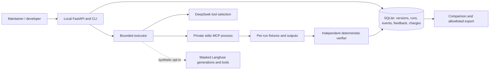

# Architecture and decisions

## ADR 001 · Task contracts before open-ended autonomy

The records task has explicit input fields, integer cents, separate currency totals and timezone-aware dates. Invalid rows fail before filtering. An independently implemented oracle recalculates expected outputs; successful tool execution alone does not establish task success. Model access is limited to four tools and synthetic inputs, with no reference answers, shell or network tools.

## ADR 002 · Materials are immutable, capabilities are fixed

A/B and custom revisions share tool names, schemas and implementation. A new material stores guide, descriptions and a content hash without replacing earlier versions. Run provenance references its material hash; a feedback revision requires a verified new run on the same task. The experiment changes the combined guide/description bundle. The frozen v0.2 guide × tool-description factorial separates the two dimensions under fixed conditions; its small task-family catalog supports exploratory conclusions.

## ADR 003 · Conservative budget reservations

One serial executor uses an atomic SQLite run claim. Every sent request reserves its input/output bound. Usage settles known responses at conservative peak rates; unresolved requests stay reserved. Completed runs cannot be claimed again. Process interruptions require manual reconciliation and never silently replay paid requests. This is a local workflow, without a distributed worker lease or multi-tenant service guarantee.

## ADR 004 · Human adoption has its own evidence

Protocol correctness, model trials, browser automation, unverified local browser instances and observed developer sessions have different cohorts. Only server verification emits task success. Event IDs deduplicate; an ordered first-session funnel reports missing links and unknown sources. Local IDs represent instances, with no claim of unique-person identification. Withdrawal removes associated feedback/events and excludes the instance from adoption aggregates.

## ADR 005 · Local service and restricted files

Bind to loopback, validate Host/Origin and JSON schemas, impose body limits and avoid inline scripts. Per-run output paths cannot select arbitrary destinations. Resolve path boundaries and reject Windows reparse points/junctions. These are application restrictions, without an OS-level adversarial sandbox claim. Public export allowlists fields and excludes identities, free text and host paths. Keys remain outside the repository.

## ADR 006 · MCPMark interoperability, original product executor

The fixed MCPMark checkout contains unrelated services and automatic data downloads. A narrow adapter exercises its original filesystem state manager, task class and verifier using one 56KB fixture archive. The original task passes through a deterministic reference workflow; it is not reported as an LLM benchmark score. AdoptLab's original executor provides product-specific SQLite states, material versions, budget and events. This preserves a working reference while keeping the first product lightweight. General MCPMark task adoption remains an extension, requiring explicit fixture/license and permission review.

## ADR 007 · Synthetic tracing is opt-in

The Langfuse integration scopes one trace to one task. Individual generations and tools are siblings under the task orchestration span. Explicit inputs show the synthetic decision context; model and usage are recorded. Pre-export masking removes secrets and host paths. A custom resource avoids automatic host metadata; exception-event spans are filtered. The SDK's public routing identifier remains in private project metadata and is excluded from public reports. The integration does not trace this coding session or personal documents.

## Compatibility

Locally exercised: Python 3.11.16, MCP Python SDK 1.30.0 (supported v1 line), FastAPI 0.142.2, Windows, installed Edge, DeepSeek Flash. The v1 SDK is pinned for stable MCPMark-compatible interfaces; migration to v2 requires transport/schema regression tests. Linux installation and container integration are verified in CI. Cloud GPUs remain untested. CPU handles file/HTTP/SQL/oracle workloads; external API infrastructure performs inference.

## v0.2 execution and evidence

External task packages select a locally registered pinned stdio container profile. The agent sees public instructions and allowlisted tools; independent rules and optional trusted extensions remain outside the MCP process. Profiles expose only read-only input and writable output mounts with disabled networking. The built-in records adapter remains supported.

Database schema v2 adds immutable registry entries, material lineage and owner records; migration saves a SQLite backup. Saved experiment limits and prices drive execution. Backend, verifier, catalogue, task, material, tool-schema and model-configuration fingerprints are distinct. Unknown model responders remain labeled and terminal failures retain their denominator. Known model or execution-condition changes suppress aggregates.

Run history and feedback handoff restore context across refreshes. Revisions require successful terminal acceptance, a changed material hash and comparable same-task conditions. Operator reconciliation only releases a run whose recorded process is dead. No paid request is replayed automatically.

[Task package contract](mcp-task-packages.md) · [Validation](v02-validation.md) · [Decisions](v02-decisions.md).

## ADR 008 · A bounded first task, full maintainer workflow

The v0.3 developer entry uses one task-01/B/protocol execution through existing run APIs. CLI first-task stores one report and independently re-verifies artifacts, task and manifest integrity. Target readiness separates required execution prerequisites from optional integrations; HTTP responses omit private paths. The maintainer deep link restores the exact run and feedback. No database migration or execution/oracle replacement is needed.

Windows reconciliation checks GetExitCodeProcess: an exited process may retain an open handle. Active or inaccessible owners remain blocked. Unresolved charges are preserved after interruption.
