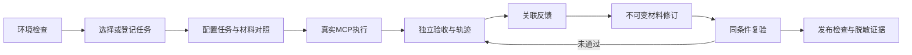

# AdoptLab v0.4 产品需求与验收

版本：2026-10-07；基线：v0.3。此文档是本次改造前的设计决策；旧版决策日期保留。

## 用户、问题与价值假设

首要用户是维护公开MCP工具的小团队及文档维护者；接入开发者是首次任务的体验对象；模型是材料实验的执行者。维护者现在可能用脚本、Promptfoo、Langfuse及表格组合完成配置、失败排查和反馈交接。AdoptLab聚焦把任务契约、材料版本、实际执行、独立验收和反馈修订连续呈现。

已知：已有真实stdio工具执行、内置记录和Filesystem适配、版本哈希及144轮模型实验。现有页面让维护者同时处理配置与原始JSON；任务导入缺少字段级预检；诊断动作较笼统。假设：集中证据与修订可以降低理解和交接成本。真实独立用户采用及节省时间尚未测得。

不用新增多Agent、RAG向量库或自动修复来制造技术复杂度。诊断以结构化查询和规则定位实现；原模型执行保留材料效果实验。界面角色不代表账号或多租户权限。

## 完整流程

开发者路径：检查内置环境→单次协议任务→理解规则与产物→提交运行关联反馈。运行状态遵从后端queued/running/succeeded/failed/cancelled/timed_out/budget_exhausted/interrupted，不用颜色代替状态说明。

## 能力与验收矩阵

| ID | 能力与输入输出 | 验收 |
|---|---|---|
| W01 | 概览读取任务、版本、实验、分组运行和预算 | 每项数值来自API；零数据有明确下一步 |
| W02 | 选择builtin/filesystem/model并检查 | 必需与可选依赖分开；错误有动作；密钥值不输出 |
| W03 | 任务与profile目录 | ID、工具、来源指纹可见；原始规则不发给模型 |
| W04 | 导入编辑任务包，预检后登记 | 无效字段可定位；预检不写DB或执行；修改既有ID被拒绝 |
| W05 | 任务×材料×重复次数×模式配置 | 提前显示运行规模；双击禁用；沿用请求、时间和费用上限 |
| W06 | 按模式与cohort查看结果 | 不可比时不展示合并效果；失败、未知、未完成保留分母 |
| W07 | 筛选、恢复运行 | 刷新恢复选中实验/运行；运行ID不串；历史报告可读 |
| W08 | 时间线、错误、规则与复验 | 轨迹来自真实记录；篡改被识别；建议标为建议而非证明根因 |
| W09 | 指南、工具描述、父版本与理由 | 保存生成新版本；工具集合匹配；旧版本不修改 |
| W10 | 原运行—反馈—新材料—新运行 | 未通过、同材料或条件不一致不得登记已验证修订 |
| W11 | 指定版本、任务集和模式做发布检查 | 最新对应运行重验；缺证据/失败/通过三种结果；导出不含自由文本 |
| W12 | 首个协议任务 | 真stdio执行、零模型费用、可取消、独立验收与反馈 |
| W13 | 观察记录与指标 | 同意、时区时间、来源与帮助级别完整；重复去重；撤回删除 |
| W14 | 公开案例、演示与报告 | 真实历史和交互演示区分；免密钥可浏览；不公开执行后端 |

## API、数据与兼容

沿用FastAPI/Jinja2/JavaScript/CSS/SQLite。新增接口：POST /api/tasks/preflight；GET /api/catalog；GET /api/tasks/{id}/package；GET /api/runs/{id}/diagnosis；POST/GET /api/releases；GET /api/releases/{id}/export；POST/GET /api/observations；DELETE /api/observations/{id}；GET /api/workbench/summary。

预检返回valid/errors/location/code/hash；登记通过后返回不可变ID与hash。诊断返回run_id/category/code/timeline/checks/actions；不会运行模型。发布检查输入experiment_id/material/tasks/mode，保存任务-运行-验收投影；不自动启动新的付费运行。观察输入匿名participant/run_id/started/ended/assistance/consent/evidence_ref/source；source为观察者录入、用户自报或自动化，录入本身不证明外部真实身份。

schema v3新增release_checks、observations。升级前使用SQLite backup；拒绝未来schema。旧运行、费用、版本、实验和报告字段不变。默认入口为中文workspace，已有developer/maintainer及CLI保留。

## 指标与事件

协议验收率=协议验收通过数/该协议分组全部运行数；模型接受率独立统计。有效产物与正确拒绝分开。发布检查通过率不是生产可靠性或采用率。

首次成功耗时仅用实际观察started→ended，并分帮助等级；脚本耗时是执行耗时。维护者闭环率需完整原运行、反馈、不同材料、同条件新运行和独立验收。观察人数不自动由本地浏览器实例数推导。

沿用entry_viewed/setup_started及后端task_started/task_verified/task_failed/feedback_submitted/revision_verified。成功由后端独立判据触发，禁止前端自报成功。观察记录有单独来源、去重指纹与撤回能力。

## 风险、发布与取舍

单用户loopback服务；容器只读输入/独立输出、关闭网络、固定image，可信自定义验证器只由CLI登记。浏览器不上传可执行脚本。预算维持现有总上限200元及实验上限，未知响应保留预留。

维护者任务编辑与发布检查优先于托管多人执行；选定14类能力全部交付。先完成资料/PRD→组件与页面→真实功能→回归和三案例闭环→公开预览。每一步有可审阅产物，不把尚未测得的采用改善写为成果。

## 测试与交付

覆盖预检无副作用、字段错误、重复ID、工具集合、DB迁移/备份、轨迹、篡改、发布缺证据/失败/通过、条件不一致、观察重复/无同意/时间错误/撤回。全套旧测试回归；三个任务实跑含外部容器；中文/英文桌面、窄屏、键盘、刷新恢复；公开树脱敏和历史报告一致性检查。

设计输出在Project_2/output；产品源码在原AdoptLab仓库；运行、缓存及浏览器截图在F盘runtime。公开发布包保留历史结果，新增v0.4记录。GitHub交付采用可审阅分支/PR；CI状态单独核验，不以本地测试替代Linux CI。
